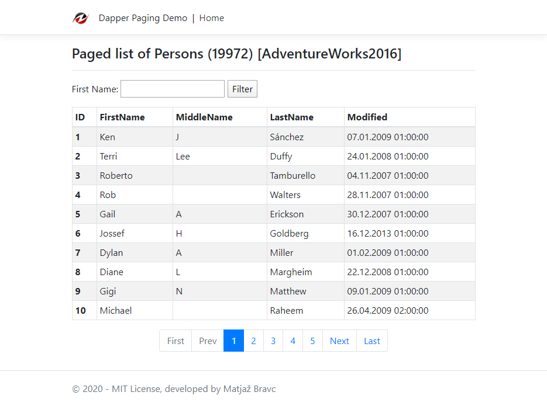
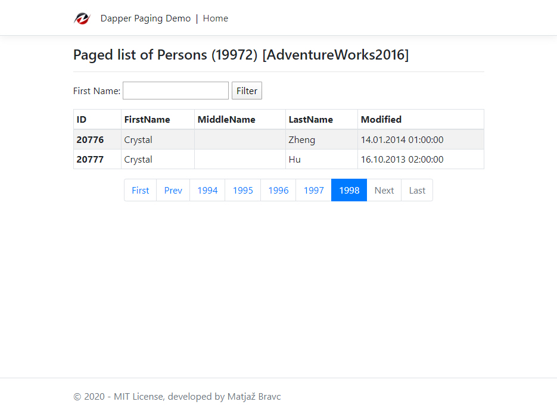
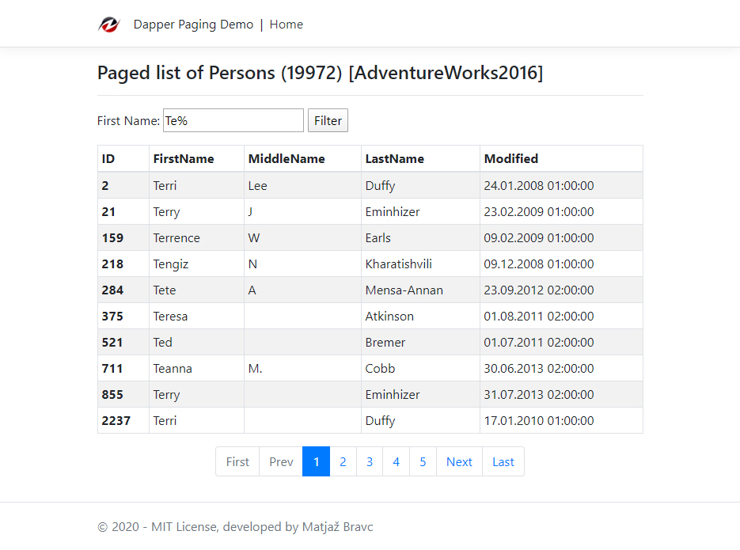

# Dapper.Paging.Demo

This simple demo application demonstrate how to implement simple paging functionality in a ASP.NET Core Razor Pages application with use of [Dapper](https://stackexchange.github.io/Dapper/) and Microsoft SQL Server.

## Dealing with large datasets
Paging is a common technique that is used when dealing with large results sets. Typically, it is not useful for an application to request millions of records at a time because there is no efficient way to deal with all those records in memory all at once. This is especially true when rendering data on a grid in a user interface. User interface can only display a limited number of records at a time so it is generally a bad practice to hold everything in memory when only a small subset of records can be displayed at given time.

We’re continuing to use [Dapper](https://stackexchange.github.io/Dapper/) for our data access. It's lightweight "Micro ORM", ultra fast and it's in production use at [Stack Overflow](https://stackoverflow.com/). You know what I mean. ;)

## Let’s start!
For this sample we will use AdventureWork2016 OLTP database. [The AdventureWorks databases](https://github.com/Microsoft/sql-server-samples/tree/master/samples/databases/adventure-works) are sample databases that were originally published by Microsoft to show how to design a SQL Server database using SQL Server.
Download backup file from [GitHub repository](https://github.com/Microsoft/sql-server-samples/releases/tag/adventureworks) and restore it to the local SQL Server instance.
All informations how to restore it you can find [here](https://github.com/Microsoft/sql-server-samples/tree/master/samples/databases/adventure-works) or [here](https://docs.microsoft.com/en-us/sql/samples/adventureworks-install-configure?view=sql-server-2017).

### Settings
We have to setup connection to SQL Server instance:
```json
{
  "SqlServerOptions": {
    "SqlServerConnection": "Data Source=localhost;Initial Catalog=AdventureWorks2016;Trusted_Connection=True;"
  },
  "Serilog": {
    "Using": [ "Serilog.Sinks.File" ],
    "MinimumLevel": {
      "Default": "Information",
      "Override": {
        "Microsoft": "Warning",
        "System": "Warning"
      }
    },
    "WriteTo": [
      {
        "Name": "Console",
        "Args": {
          "outputTemplate": "{Timestamp:yyyy-MM-dd HH:mm:ss.fff} [{Level:u3}] [{SourceContext}] {Message}{NewLine}{Exception}",
          "restrictedToMinimumLevel": "Verbose"
        }
      },
      {
        "Name": "File",
        "Args": {
          "path": "./Log/DemoLog.txt",
          "outputTemplate": "{Timestamp:yyyy-MM-dd HH:mm:ss.fff} [{Level:u3}] [{MemberName}] {Message}{NewLine}{Exception}",
          "fileSizeLimitBytes": 1073741824,
          "rollingInterval": "Day",
          "rollOnFileSizeLimit": true,
          "restrictedToMinimumLevel": "Information",
          "retainedFileCountLimit": "3",
          "shared": true,
          "flushToDiskInterval": "00:00:01"
        }
      }
    ],
    "Enrich": [ "FromLogContext" ],
    "Properties": {
      "Application": "Dapper.Paging.Demo"
    }
  },
  "AllowedHosts": "*"
}
```
### Create an Person Model/Entity
For this simple demo we will use just Persons model:
```csharp
using System;
using System.ComponentModel.DataAnnotations;

namespace Dapper.Paging.Demo.Models
{
    /// <summary>
    /// Simplified Person model/entity
    /// </summary>
    [Serializable]
    public class Person
    {
        [Key]
        [Display(Name = "Person Id")]
        public int BusinessEntityID { get; set; }

        [Required]
        [Display(Name = "Person Type")]
        public string PersonType { get; set; }

        [Display(Name = "Person Title")]
        public string Title { get; set; }

        [Required]
        [Display(Name = "Person First name")]
        public string FirstName { get; set; }

        [Display(Name = "Person First name")]
        public string MiddleName { get; set; }

        [Required]
        [Display(Name = "Person LAst name")]
        public string LastName { get; set; }

        [Display(Name = "Person Sufix")]
        public string Suffix { get; set; }

        [Display(Name = "Modified")]
        public DateTime ModifiedDate { get; set; } = DateTime.UtcNow;
    }
}
```

### Create Person Repository
The next step is to create a Person Repository with single method GetAsync which reads paged items from [Person].[Person] table:
```csharp
using Dapper.Paging.Demo.Configuration;
using Dapper.Paging.Demo.Models;
using Dapper.Paging.Demo.Services;
using Microsoft.Extensions.Options;
using System.Data.SqlClient;
using System.Threading.Tasks;

namespace Dapper.Razor.Demo.Services.Repositories
{
    /// <summary>
    /// Persons repository
    /// </summary>
    public class PersonRepository : IPersonRepository
    {
        private readonly SqlServerOptions _sqlServerOptions;

        public PersonRepository(IOptions<SqlServerOptions> sqlServerOptions)
        {
            _sqlServerOptions = sqlServerOptions.Value;
        }

        public async Task<PagedResults<Person>> GetAsync(string searchString = "", int pageNumber = 1, int pageSize = 10)
        {
            using (var conn = new SqlConnection(_sqlServerOptions.SqlServerConnection))
            {
                await conn.OpenAsync();

                // Set first query
                var whereStatement = string.IsNullOrWhiteSpace(searchString) ? "" : $"WHERE [FirstName] LIKE '{searchString}'";
                var queries = @$"
                SELEC
                    [BusinessEntityID],
                    [PersonType],
                    [Title],
                    [FirstName],
                    [MiddleName],
                    [LastName],
                    [Suffix],
                    [ModifiedDate] FROM [Person].[Person] (NOLOCK)
                {whereStatement}
                ORDER BY [BusinessEntityID]
                OFFSET @PageSize * (@PageNumber - 1) ROWS
                FETCH NEXT @PageSize ROWS ONLY;"

                // Set second query, separated with semi-colon
                queries += "SELECT COUNT(*) AS TotalItems FROM [Person].[Person] (NOLOCK);";

                // Execute multiple queries with Dapper in just one step
                using var multi = await conn.QueryMultipleAsync(queries,
                    new
                    {
                        PageNumber = pageNumber,
                        PageSize = pageSize
                    });

                // Fetch Items by OFFSET-FETCH
                var items = await multi.ReadAsync<Person>().ConfigureAwait(false);

                // Fetch Total items count
                var totalItems = await multi.ReadFirstAsync<int>().ConfigureAwait(false);

                // Create paged result
                var result = new PagedResults<Person>(totalItems, pageNumber, pageSize)
                {
                    Items = items
                };
                return result;
            }
        }
    }
}
```
The key for retrieving paged items we are using **SQL OFFSET-FETCH Clause** which were introduced with SQL Server 2012 and which are great for building pagination support.
Some additional informations about **SQL OFFSET-FETCH Clause** you can find [here](https://www.geeksforgeeks.org/sql-offset-fetch-clause/).

According to input parameters we are returning Paged results with this helper class:
```csharp
using System;
using System.Collections.Generic;
using System.Linq;

namespace Dapper.Paging.Demo.Services
{
    /// <summary>
    /// Helper class for returning paged results
    /// </summary>
    /// <typeparam name="T"></typeparam>
    public class PagedResults<T>
    {
        public PagedResults(int totalItems,
            int pageNumber = 1,
            int pageSize = 10,
            int maxNavigationPages = 5)
        {
            // Calculate total pages
            var totalPages = (int)Math.Ceiling(totalItems / (decimal)pageSize);

            // Ensure actual page isn't out of range
            if (pageNumber < 1)
            {
                pageNumber = 1;
            }
            else if (pageNumber > totalPages)
            {
                pageNumber = totalPages;
            }

            int startPage;
            int endPage;
            if (totalPages <= maxNavigationPages)
            {
                startPage = 1;
                endPage = totalPages;
            }
            else
            {
                var maxPagesBeforeActualPage = (int)Math.Floor(maxNavigationPages / (decimal)2);
                var maxPagesAfterActualPage = (int)Math.Ceiling(maxNavigationPages / (decimal)2) - 1;
                if (pageNumber <= maxPagesBeforeActualPage)
                {
                    // Page at the start
                    startPage = 1;
                    endPage = maxNavigationPages;
                }
                else if (pageNumber + maxPagesAfterActualPage >= totalPages)
                {
                    // Page at the end
                    startPage = totalPages - maxNavigationPages + 1;
                    endPage = totalPages;
                }
                else
                {
                    // Page in the middle
                    startPage = pageNumber - maxPagesBeforeActualPage;
                    endPage = pageNumber + maxPagesAfterActualPage;
                }
            }

            // Create list of Page numbers
            var pageNumbers = Enumerable.Range(startPage, (endPage + 1) - startPage);

            StartPage = startPage;
            EndPage = endPage;
            PageNumber = pageNumber;
            PageNumbers = pageNumbers;
            PageSize = pageSize;
            TotalItems = totalItems;
            TotalPages = totalPages;
        }

        public IEnumerable<T> Items { get; set; }

        /// <summary>
        /// Total number of items to be paged
        /// </summary>
        public int TotalItems { get; set; }

        /// <summary>
        /// Maximum number of page navigation links to display, default is 5
        /// </summary>
        public int MaxNavigationPages { get; private set; } = 5;

        /// <summary>
        /// Current active page
        /// </summary>
        public int PageNumber { get; private set; } = 1;

        /// <summary>
        /// Number of items per page, default is 10
        /// </summary>
        public int PageSize { get; private set; } = 10;

        public int TotalPages { get; private set; }

        /// <summary>
        /// Start Page number
        /// </summary>        
        public int StartPage { get; private set; }

        /// <summary>
        /// End Page number
        /// </summary>        
        public int EndPage { get; private set; }

        /// <summary>
        /// List of page numbers that we can loop
        /// </summary>
        public IEnumerable<int> PageNumbers { get; private set; }
    }
}
```

### Usage in Index.cshtml Page Model
In the Page constructor we injects PersonRepository and OnGet we retrieve Paged results.
```csharp
using Dapper.Paging.Demo.Models;
using Dapper.Paging.Demo.Services;
using Dapper.Razor.Demo.Services.Repositories;
using Microsoft.AspNetCore.Mvc.RazorPages;
using Microsoft.AspNetCore.Mvc;
using System.Threading.Tasks;
using System;

namespace Dapper.Paging.Demo.Pages
{
    /// <summary>
    /// Index Page Model
    /// </summary>
    public class IndexModel : PageModel
    {

        readonly IPersonRepository _personRepository;

        public IndexModel(IPersonRepository personRepository)
        {
            _personRepository = personRepository ?? throw new ArgumentNullException(nameof(personRepository));
        }

        [BindProperty]
        public PagedResults<Person> Persons { get; set; }

        [BindProperty(SupportsGet = true)]
        public string SearchString { get; set; }

        /// <summary>
        /// Initializes any state needed for the page, in our case Persons List
        /// </summary>
        public async Task OnGetAsync(int pageNumber = 1)
        {
            Persons = await _personRepository.GetAsync(SearchString, pageNumber).ConfigureAwait(false);
        }
    }
}
```
### Content Page
And the content page (Index.cshtml) looks like this:
```html
@page
@model IndexModel
@{
    ViewData["Title"] = "Persons page";
}

<h4>Paged list of Persons (@Model.Persons.TotalItems) [AdventureWorks2016]</h4>
<hr />
@{
    TimeZoneInfo cstZone = TimeZoneInfo.FindSystemTimeZoneById("W. Europe Standard Time");
}
<form>
    <p>
        First Name: <input type="text" asp-for="SearchString" />
        <input type="submit" value="Filter" />
    </p>
</form>
<table class="table table-sm table-striped table-bordered">
    <thead>
        <tr>
            <th scope="col">ID</th>
            <th scope="col">FirstName</th>
            <th scope="col">MiddleName</th>
            <th scope="col">LastName</th>
            <th scope="col">Modified</th>
        </tr>
    </thead>
    <tbody>
        @foreach (var person in Model.Persons.Items)
        {
            <tr>
                <th scope="row">@person.BusinessEntityID</th>
                <td>@person.FirstName</td>
                <td>@person.MiddleName</td>
                <td>@person.LastName</td>
                @{
                    var modifiedDateTime = person.ModifiedDate > DateTime.MinValue ? TimeZoneInfo.ConvertTimeFromUtc(person.ModifiedDate, cstZone).ToString("dd.MM.yyyy HH:mm:ss") : "N/A";
                }
                <td>@modifiedDateTime</td>
            </tr>
        }
    </tbody>
</table>

@if (Model.Persons.PageNumbers.Any())
{
    <nav class="table-responsive">
        <ul class="pagination justify-content-center d-flex flex-wrap">
            <li class="page-item @(Model.Persons.PageNumber > 1 ? "enabled" : "disabled")">
                <a class="page-link" href="/">First</a>
            </li>
            <li class="page-item @(Model.Persons.PageNumber > 1 ? "enabled" : "disabled")">
                <a class="page-link" href="/?pageNumber=@(Model.Persons.PageNumber - 1)">Prev</a>
            </li>

            @foreach (var pageNumber in Model.Persons.PageNumbers)
            {
                <li class="page-item @(pageNumber == Model.Persons.PageNumber ? "active" : "")">
                    <a class="page-link" href="/?pageNumber=@pageNumber">@pageNumber</a>
                </li>
            }

            <li class="page-item @(Model.Persons.PageNumber < Model.Persons.TotalPages ? "enabled" : "disabled")">
                <a class="page-link" href="/?pageNumber=@(Model.Persons.PageNumber + 1)">Next</a>
            </li>
            <li class="page-item @(Model.Persons.PageNumber < Model.Persons.TotalPages ? "enabled" : "disabled")">
                <a class="page-link" href="/?pageNumber=@(Model.Persons.TotalPages)">Last</a>
            </li>
        </ul>
    </nav>
}
```
## Web User interface

For a Web Client we used **ASP.NET Core Razor** Pages which can make coding page-focused scenarios easier and more productive than using controllers and views.
On the first page, the Previous and First links are disabled, thanks to the styling from Bootstrap 4. They become active on subsequent pages. Result looks like this:





You can also filter results by Person's first name:



This example demonstrate also the following functionalities:
- [ASP.NET Core 3.1 Razor Pages](https://docs.microsoft.com/en-us/aspnet/core/razor-pages/?view=aspnetcore-3.1&tabs=visual-studio)
- Global Error Handling
- Logging with [Serilog](https://serilog.net/) sink to file

## Prerequisites
- [Visual Studio](https://www.visualstudio.com/vs/community) 2019 16.4.5 or greater
- [.NET Core SDK 3.1](https://dotnet.microsoft.com/download/dotnet-core/3.1)

## Tags & Technologies
- [ASP.NET Core 3.1](https://docs.microsoft.com/en-us/aspnet/?view=aspnetcore-3.1#pivot=core)
- [ASP.NET Core 3.1 Razor Pages](https://docs.microsoft.com/en-us/aspnet/core/razor-pages/?view=aspnetcore-3.1&tabs=visual-studio)
- [Dapper](https://github.com/StackExchange/Dapper)

Enjoy!

## Licence
Licenced under [MIT](http://opensource.org/licenses/mit-license.php).
Contact me on [LinkedIn](https://si.linkedin.com/in/matjazbravc).
